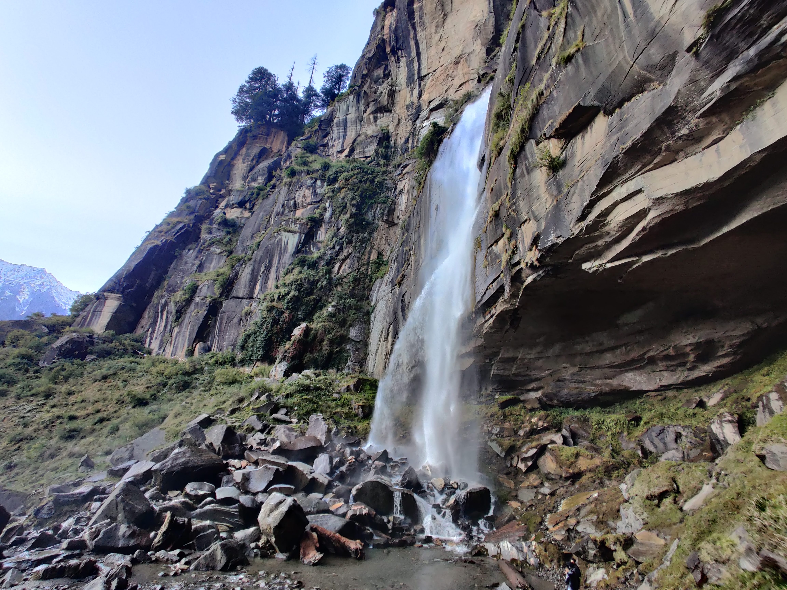
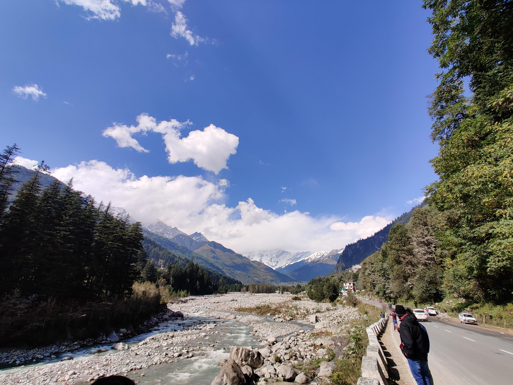
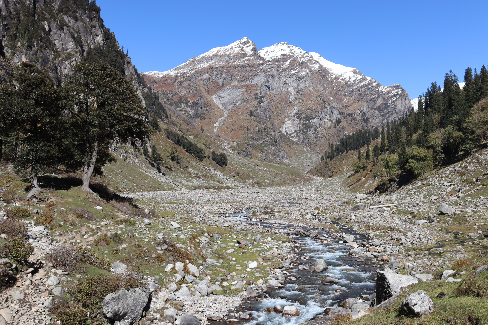
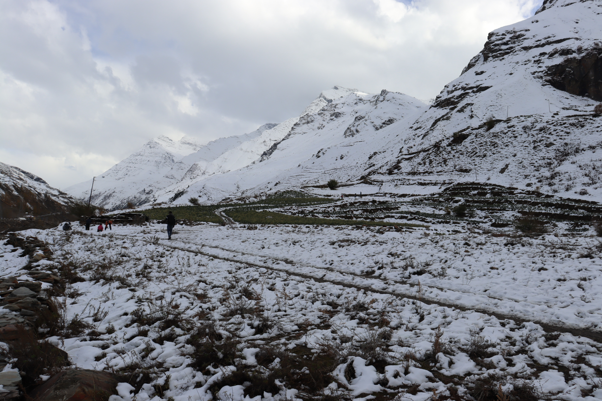
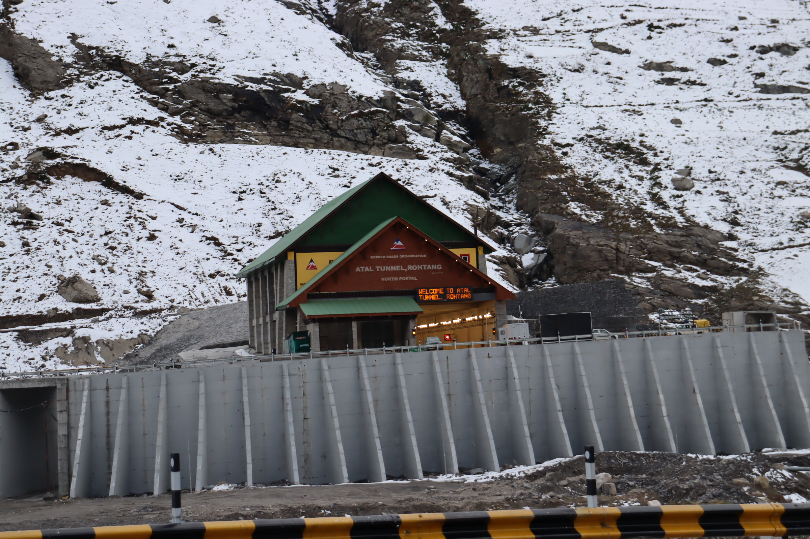
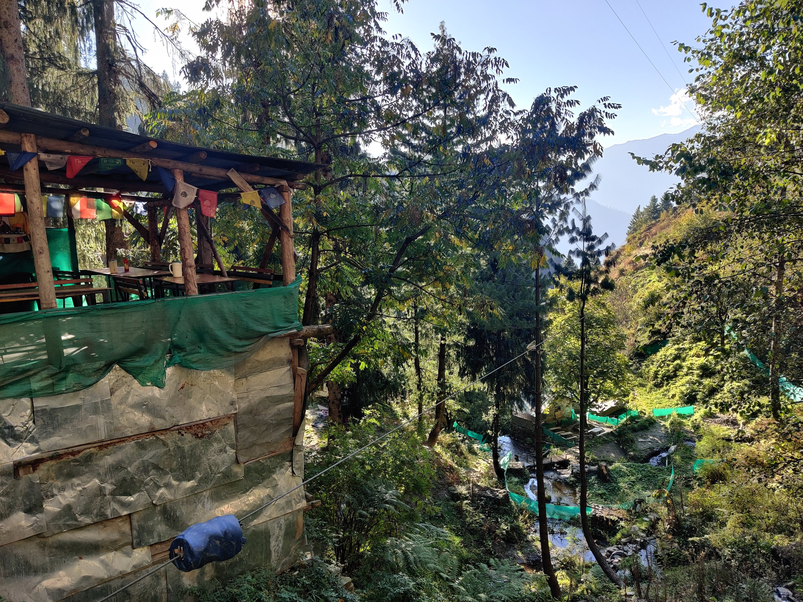
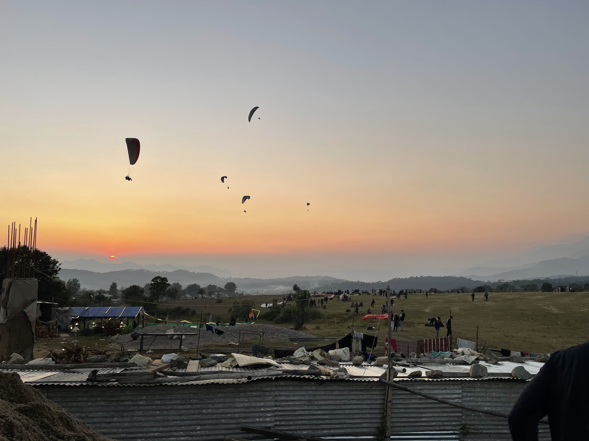
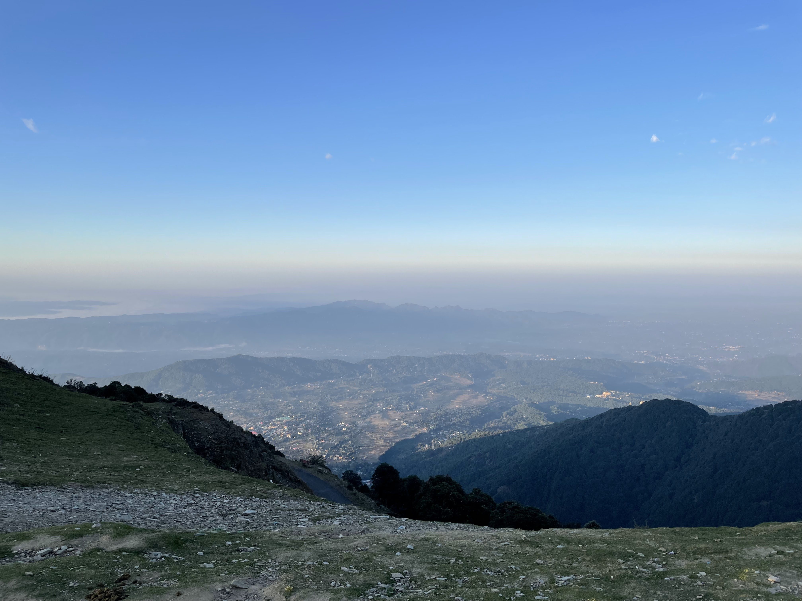
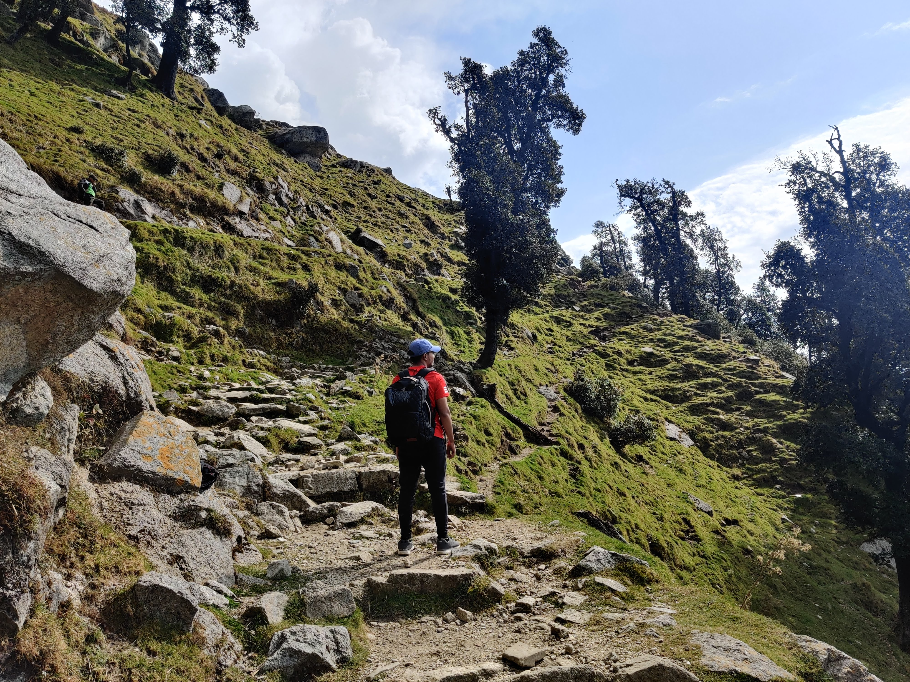
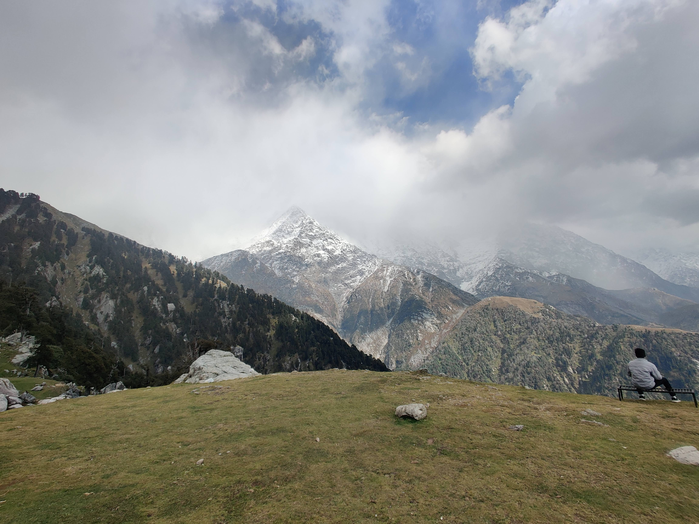

I graduated from college in 2020. We (Me and my college friends) had planned to visit Goa after graduation. But who knew that a global pandemic would happen forcing us to sit in our homes.

So now, after around 2 years, as the situation is coming back to normal, we decided to visit Manali, and a few planes nearby it.\
This blog is a note of my experiences which could be helpful if you are planning to visit any of the places I did.

## Manali

Reaching to any of the hill stations is easy from Delhi. You can easily get a cab/bus. We took a overnight bus so we could have some sleep.

Also, during our entire trip, we did not stay in any hotels, but only Hostels. Believe me, hostels are a lot better and a lot cheaper too in comparison to hotels. You get a chance meet many new exciting people. I stayed in **[The Hosteller, Manali](https://thehosteller.com/hostels/manali/)**. Really good experience there if you ask me, met a lot of good people and I am in touch with them even after the trip. Would definitely recommend this if you are planning to stay in hostel.

### Places to visit

- **Jogni Falls**

Located **10-13kms from Old Manali**, Jogni falls is a very small trek which you can do in a **5-6 hours**. On the way going to the waterfall, you may find awesome views of the snow covered mountains. Reaching the top, the view which you get is something which is worth the efforts.\
Also, for moviebuffs, this is the same river where Bunny and his team starts their trek in movie YJHD.

There is a temple also on the way to Jogni Falls, of Rishi Vashisht. Inside the temple, there are hot water springs where you can have a warm bath also.

- **Hampta Valley**

All those who do the Hampta Pass trek, start their trek from this valley. This is located about **20kms from Old Manali**. You can take a cab which will take you to the mountain and from mountain, its will take approximately 3 hours to reach valley. Within **6 hours**, you can be back.

Very serene atmosphere here. Those who have a habit of listening to white noise should definitely visit this place and experience the *"natural"* white noise of the river flowing. 

- **Sissu**

Sissu is sort of a snow point which I visited. Initially, we had planned to visit **Rohtang**, but due to excessive snowfall and bad weather conditions, all the places on top including Rohtang were closed. Sissu is approximately 20kms from Rohtang and about **40-45kms from Old Manali.** You can easily get a private cab which costs about ₹2000-3000 from Old Manali.

Here, you can also do some adventure sports like Zipline or ride an ATV. Both costs around ₹500-1000.

Enroute to Sissu, you get to see the amazing **Atal Tunnal**. The locals say that with this tunnel, approximately 70-80kms distance which previously took 5-6hrs to cross, now takes only 9.6kms and 15-20mins. Truly as they say it is called, it is an *engineering marvel*.

- **Naggar village**

This is located 40kms from Old Manali.
The main attraction here are two things: a cafe that serves delicious local food thali which has red rice, siddu, a local dish of manali, ghee, makki ki roti, curd, jaggrey powder and pickle. Another is a zipline that is about 500mts long.

### Good Food

Cafe Rocky's (Superb View. If possible, visit at sunset) \
The Lazy Dog (Posh cafe with good ambience and live music)\
Jhonsons Cafe \
Cafe 1986 

## Bir, Billing

Bir is a place which is known all over the world for paragliding. It is about 6hrs ride from Manali and you can use the state transport for that. Ticket costs about ₹450.

Our stay in Bir was at [Moustache Hostel](https://moustachescapes.com/accommodation/Hostel/moustache-bir). Decent one for the price I must say.

Once you reach Bir, its simple. Any person you ask can contact you to a paragliding team which will arrange the necessary things for you. 

Best time for paragliding IMO would be at sunrise. The atmosphere is cold, and you get to see beautiful sun rising from mountains while in air. 

This is the landing site, bir of the paragliders.

This is the take-off site, billing of the paragliders.

### Good Food

Did not explore much, but Himalayan Pizza is good.

## Mcleodganj

Our stay was again Moustache Mcleodganj. Not bad, but not good either. Due to time constraints, we did not look for other options.

Mcloedganj is located about 2hrs from Bir. You can take a cab which will cost approx ₹3000. In terms of development, Mcleodganj is not much developed. But Dharamshala is a full blown city which has malls and stuff also.

The primary purpose of visiting Mcloedganj was to do the Triund Trek which is a proper one day trek. For first timers, this trek would require efforts to complete.

View from the top of the Triund

Other major attractions in Mcleodganj are **Dharamshala Stadium**, **Tea gardens** and **War Memorial**. You can book a cab for a day which will take you to all these places.

## Good Food

Illerati Cafe: Books and Coffee (Awesome Vibe)\
Tibet Kitchen
